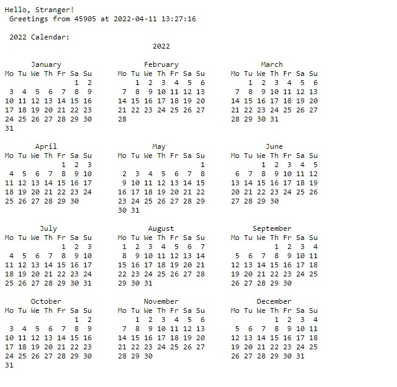

## To see the serverless function :
- First click on this [url](https://serverless-functions-sandy.vercel.app/)
- Then type **/api/Hi** at the end of the url path
- You will see the calendar of this year, plus the datetime and week number/month.

As can be seen in the picture below: 

**I Used the aprsing method Yahiha Mentioned on SLACK**